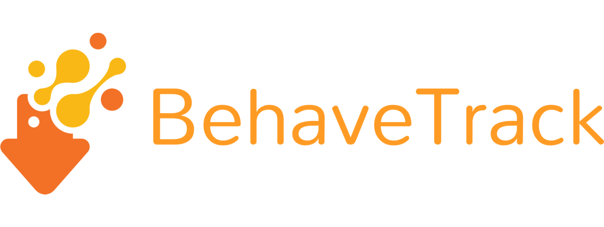

[//]: # (# BehaveTrack)
<p align="center">

</p>
BehaveTrack uses user-specific B-SOiD/A-SOiD classifier to predict behavior based on pose. 
Generate ethogram and summary statistics for animal recordings. 
Intuitive interface for tagging and grouping files. 
Enhance animal behavior studies with accurate and reliable predictions.


### Install
create a conda environment
```markdown
conda create -n behavetrack python==3.9 -y 
conda activate behavetrack
```
clone github repo and change directory into repo
```markdown
git clone https://github.com/runninghsus/BehaveTrack.git
cd BehaveTrack
```
install dependencies
```markdown
pip install -r requirements.txt
```


### Usage
Run the streamlit app
```markdown
streamlit run behavetrack.py
```

### Existing

Quality of life improvements: 
* Drag and drop B-SOiD trained classifier
* Drag and drop A-SOiD trained classifier
* Using example video to annotate user-definition 
* Organize files into 2+ conditions for comparisons, including the following:

Reactive post-hoc analyses:
* ethogram
* behavior location
* behavior ratio
* behavioral frequency
* behavior duration
* behavior transition


### In progress
Quality of life improvements: 
* annotation retrieval from A-SOiD
Reactive post-hoc analyses: 
* behavioral pose speed


### Project funding
Glen de Vries Presidential Fellowship for Biological Sciences at Carnegie Mellon University.


### Website
This is currently developed by Alex Hsu to support research using [B-SOiD](https://bsoid.org/).


### LICENSE
BehaveTrack is released under a 
[BSD 3-Clause "New" or "Revised" License](https://github.com/runninghsus/BehaveTrack/blob/main/LICENSE) 
and is intended for research/academic use only.

---